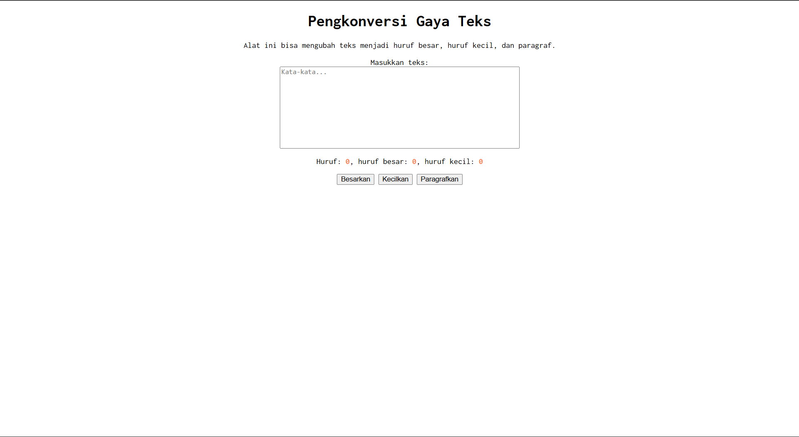

# Tugas Pendahuluan 03: GUI dengan HTML dan CSS

**Nama:** Jati Christanov Dite
**NIM:** 103122400032
**Kelas:** SE-08-01

## Tugas

Membuat antarmuka pengguna (GUI) sederhana menggunakan HTML dan CSS untuk aplikasi "Pengkonversi Gaya Teks". Aplikasi harus memiliki fitur untuk mengubah teks menjadi huruf besar, huruf kecil, dan format paragraf (sentence case), serta menampilkan statistik jumlah karakter, huruf besar, dan huruf kecil secara real-time. Tata letak harus berada di tengah dan menggunakan font monospace **Inconsolata**.

## Program/Kode

Tersedia di [index.html](./index.html), [index.css](./index.css), [index.js](./index.js)

## Output

## Deskripsi

Penerapan HTML, CSS, dan JavaScript, di mana pengguna dapat memasukkan teks ke dalam textarea. JavaScript digunakan untuk menghitung jumlah karakter, huruf besar, dan huruf kecil secara langsung saat pengguna mengetik, serta melakukan transformasi teks melalui tombol yang tersedia. CSS digunakan untuk mengatur tampilan antarmuka agar rapi dan berada tepat di tengah (menggunakan `text-align: center` pada body dan `margin: auto` pada kotak input) dengan menggunakan font monospace **Inconsolata**.
