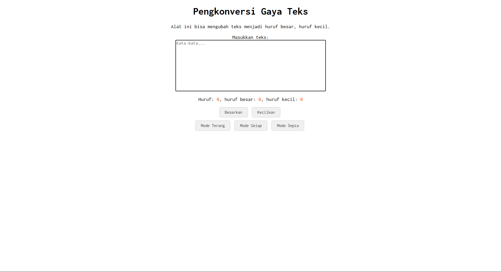

# Tugas Mandiri 04: Automata dan Table-Driven Construction

**Nama:** Tony Hendrawan  
**NIM:** 103122400021  
**Kelas:** SE-08-01

## Tugas

Menambahkan fitur mode sepia ke dalam aplikasi pengkonversi gaya teks.

## Program/Kode

Tersedia di [index.html](./index.html), [index.css](./index.css), [index.js](./index.js)

## Output

## Deskripsi

Proyek ini mengimplementasikan fitur mode sepia dengan skema warna khusus: latar belakang `#F4ECD8` dan teks `#5B4636`. Penambahan dilakukan dengan memperluas sistem manajemen state pada `index.js` agar dapat mengenali input dari tombol sepia yang baru ditambahkan di `mode-div`. Dengan memanfaatkan manipulasi class CSS secara dinamis, aplikasi dapat beralih ke tema sepia secara mulus dengan efek transisi yang sudah dioptimalkan.
