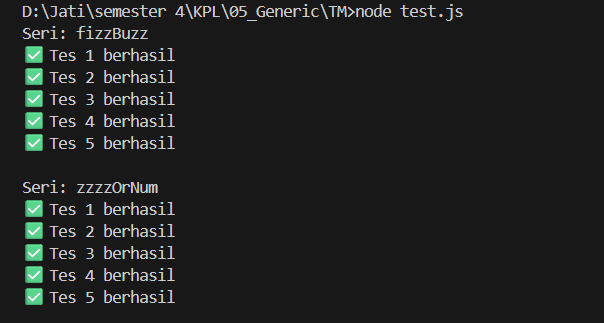

# Tugas Mandiri 05: Generics

**Nama:** Jati Christanov Dite  
**NIM:** 103122400032  
**Kelas:** SE-08-01

## Tugas

Membuat FizzBuzz dengan aturan kali ini adalah:

1. Fungsi `fizzBuzz` hanya menerima larik yang semua elemennya terdiri dari bilangan bulat dan mengeluarkan larik pula yang bisa jadi bercampur string dan bilangan.
2. Fungsi `zzzzOrNum` hanya menerima sebuah data tunggal berupa bilangan bulat dan mengembalikan "Fizz", "FizzBuzz", "Buzz", atau bilangan bulat sesuai logikanya.
3. Kedua fungsi harus ada dan harus disertai JSDoc sesuai tipe data yang disiratkan dari no. 1, no. 2, dan perilaku yang diharapkan.
4. `fizzBuzz` harus menggunakan fungsi `zzzzOrNum` di dalamnya.

## Program/Kode

Tersedia di [index.js](./index.js), [test.js](./test.js)

## Output

## Deskripsi

Implementasi ini menggunakan pendekatan fungsional dengan memanfaatkan metode `.map()` untuk mentransformasi setiap elemen dalam array secara efisien. Logika utama berada pada fungsi `zzzzOrNum` yang mengevaluasi kondisi pembagian angka terhadap pembagi 3 dan 5 menggunakan operator modulus. Fungsi `fizzBuzz` bertindak sebagai wrapper yang memastikan validitas input array sebelum mendelegasikan pemrosesan setiap angka ke `zzzzOrNum`.
