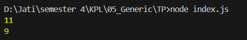

# Tugas Pendahuluan 05: Generics

**Nama:** Jati Christanov Dite  
**NIM:** 103122400032

**Kelas:** SE-08-01

## Tugas

Bagaimana caramu hanya dengan satu fungsi generik bisa mengurus kode jumlah karakter dan huruf?

## Program/Kode

Tersedia di [index.js](./index.js)

## Output

## Deskripsi

Program ini mengimplementasikan sebuah fungsi generik bernama `hitung` yang dirancang untuk fleksibilitas dalam mengolah data string. Fungsi ini menerima dua argumen: string input dan kategori perhitungan (tipe). Dengan menggunakan struktur kontrol di dalam iterasi karakter, fungsi dapat membedakan antara menghitung seluruh isi string (termasuk spasi) atau hanya menghitung karakter huruf saja dengan cara mengabaikan spasi. Pendekatan ini memungkinkan satu fungsi yang sama untuk menjalankan dua tugas berbeda secara efisien, yang kemudian hasilnya dikembalikan untuk ditampilkan melalui konsol.
