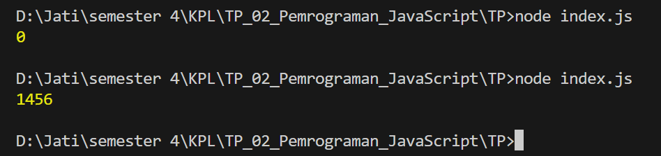

# Tugas Pendahuluan 02: Pemrograman JavaScript
**Soal**

Kamu sudah menulis fungsi mulOfArray. Ujilah dengan input [2, 0, 26, 28, -2], dengan output yang seharusnya adalah 1456. Jika kamu menemukan bahwa hasilnya berbeda, bisakah kamu memperbaikinya? Jika kamu menemukan bahwa hasilnya sama, bisakah kamu menjelaskan mengapa demikian?

**Jawaban**
Ketika kode sumber masih menggunakan yang lama, maka hasil output nya adalah 0. Hal ini dikarenakan di dalam fungsi if terdapat kondisi dimana array >= 0 (arr1[i] >= 0) yang berarti bilangan 0 juga ikut dikalikan. Bilangan berapapun yang dikalikan dengan 0 maka hasilnya adalah 0. Ketika saya rubah kondisi operatornya menjadi hanya > (arr1[i] > 0), maka hasilnya adalah 1456, hal tersebut dikarenakan bilangan yang dikalikan hanya bilangan yang lebih besar dari 0 saja, dan 0 tidak termasuk kedalamnya 

**Kode sumber**
const arr1 = [2, 0, 26, 28, -2];

function mulOfArray (arr) {
    let result = 1

    for (let i = 0; i < arr.length; i = i + 1) {
        if (arr[i] > 0) {
            result = result * arr[i]
        }
    }

    return result
}

//memanggil fungsi
const arr1Result = mulOfArray(arr1);
console.log(arr1Result);

Tersedia di [\[index.js\]()](index.js)

**Output**

**Deskripsi Program**

Program ini menjalankan perkalian semua bilangan positif dalam larik (_array_). Ini akan bekerja untuk bilangan positif, nol, dan negatif. Bilangan nol tidak dihitung karena kondisi yang digunakan hanya kondisi dimana bilangan lebih besar dari nol

